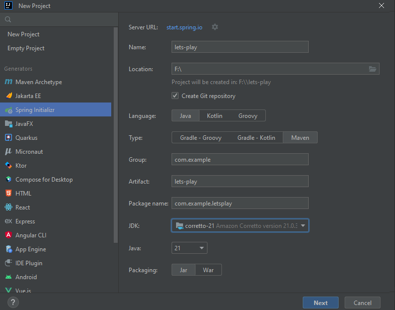
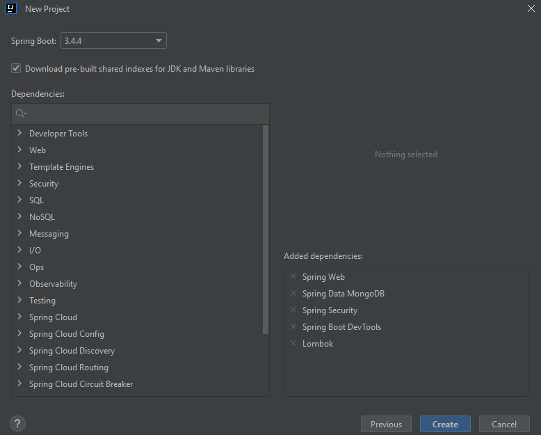
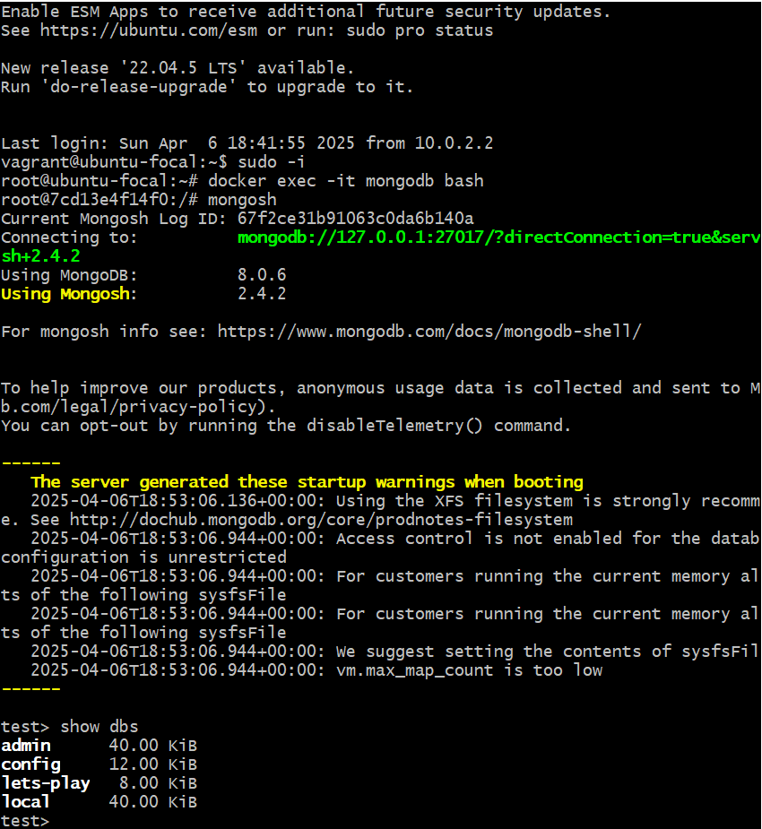

# We will create a Spring Boot CRUD API
This project implements a CRUD API using Spring Boot, Java, and MongoDB, and it is secured with JWT-based authentication.

The application follows a layered architecture (Controller, Service, Repository) and incorporates:
- Data validation
- Global exception handling
- CORS configuration
- Basic rate limiting

We adopt a step-by-step Test-Driven Development (TDD) approach using JUnit 5.

## 1. Project Setup with Spring Initializr
### 1.1  IntelliJ's "New Project > Spring Initializr"



### 1.2 Add JWT, bean validation dependencies manually

### 1.3 Project Structure:
* com.example.letsplay (base package)
    * controller (REST controllers)
    * service (logic)
    * repository (for Spring Data MongoDB repositories)
    * model (for MongoDB data models)
    * config (any config)
    * exception (for custom exceptions)
    * dto (for data transfer objects)
### 1.3 Running MongoDB Using Vagrant
- We use a Vagrantfile to set up a CentOS-based virtual machine that runs Docker and a MongoDB container.
#### Accessing MongoDB
After starting the VM, MongoDB runs inside a Docker container with port 27017 forwarded to the VM. 
To access MongoDB from your host machine or another computer on the network, use the VM's IP address.
#### Verifying the Database
- SSH into your VM
```bash
vagrant ssh
sudo -i
docker exec -it mongodb bash
```
- Launch the MongoDB shell
```bash
mongosh
```
- Run
```bash
show dbs 
```
Find the VM's IP Address:
You can determine the IP address by running vagrant ssh and then using commands like ip addr

### 1.4 Configure the MongoDB connection
```
src/main/resources/application.properties
```
```properties
spring.data.mongodb.uri=mongodb://<HOST>:27017/<DATABASE>
spring.data.mongodb.uri=mongodb://192.168.56.82:27017/lets-play
```
Replace <HOST> with the IP address or hostname of your MongoDB server and <DATABASE> with your database name

## 2 